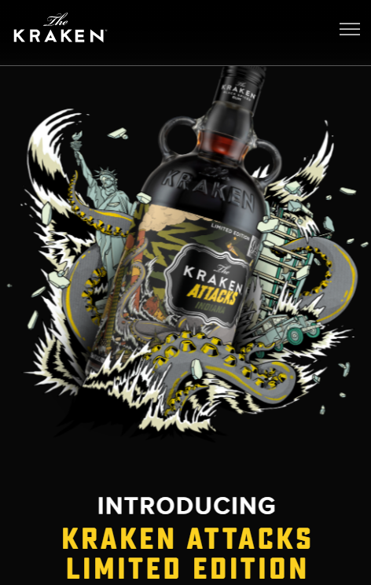
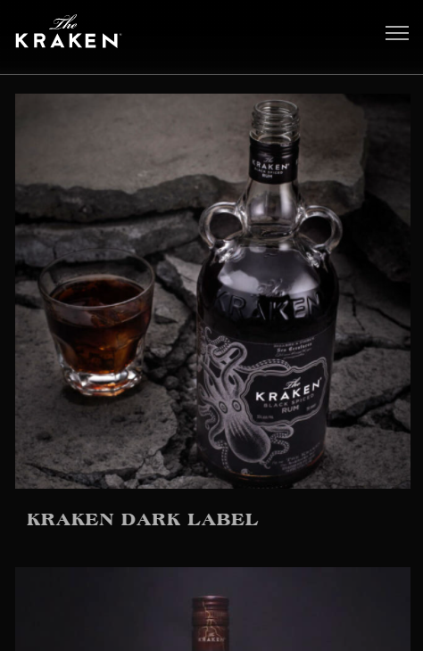
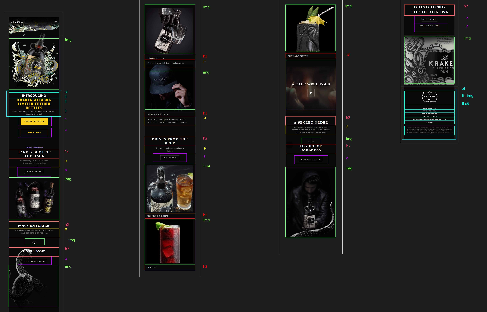
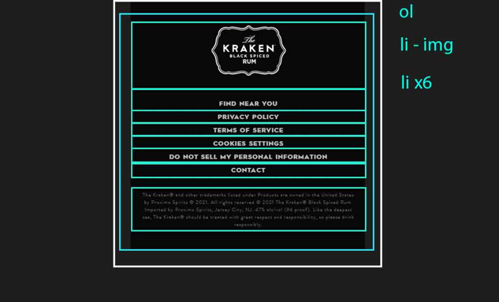
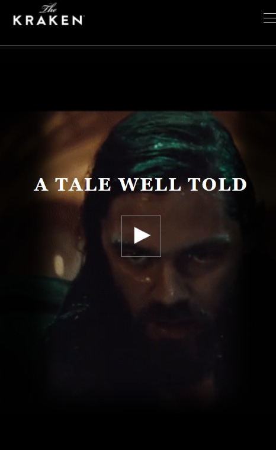
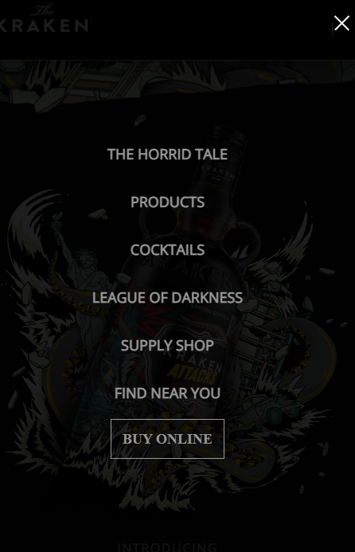
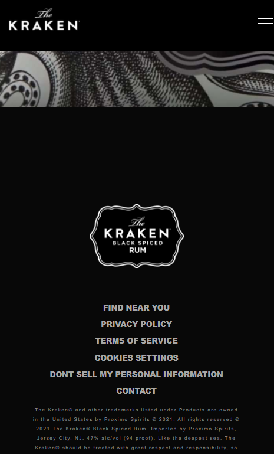

# Procesverslag
Markdown is een simpele manier om HTML te schrijven.  
Markdown cheat cheet: [Hulp bij het schrijven van Markdown](https://github.com/adam-p/markdown-here/wiki/Markdown-Cheatsheet).

Nb. De standaardstructuur en de spartaanse opmaak van de README.md zijn helemaal prima. Het gaat om de inhoud van je procesverslag. Besteedt de tijd voor pracht en praal aan je website.

Nb. Door *open* toe te voegen aan een *details* element kun je deze standaard open zetten. Fijn om dat steeds voor de relevante stuk(ken) te doen.

## Jij

uitwerken voor kick-off werkgroep

### Auteur:
Chris Gabriel III

#### Je startniveau:
Rood

#### Je focus:
Surface plane
 

## Je website

### Je opdracht:
https://www.krakenrum.com/cocktails/

#### Screenshot(s) van de eerste pagina (small screen): 
Kraken black rum home screen

#### Screenshot(s) van de tweede pagina (small screen):
Products page

 

## Breakdownschets (week 1)

Deze week heb ik in de klas gewerkt aan de breakdownschets voor mijn pagina, mijn ervaring met coderen is echter nogal weinig dus weet ik nog niet tot hoeverre ik mij
aan deze breakdownschets ga houden.

### de hele pagina: 

### Footer

Alhoewel ik heel veel content blokken op dezelfde manier kan indelen zouden de header en footer wel wat anders in elkaar gezet worden.

## Voortgang 1 (week 2)

een aantal stukken gingen nogal lastig bij het maken van de eerste versie van de site, vooral de responsiveness was voor mij niet te doen.

### Stand van zaken
De look and feel van de site had ik wel snel te pakken, ook omdat de afbeeldingen op de site makkelijk te downloaden waren, de kleuren en fonts moest ik nog wel even voor zoeken.

## Voortgang 2 (week 3)

uitwerken voor 2e voortgang

### Stand van zaken
Robert heeft nog naar mijn site gekeken, hij merkte een paar dingen op:
de header kan in een <header> tag geplaatst worden, de images hadden nog geen alt tags, een aantal typfouten waren gemaakt en ik had de JS tag nog niet onderaan,
er moest ook nog wel aardig wat gedaan worden aangezien ik nog een beetje achter liep

## Toegankelijkheidstest (week 4)

we waren bezig met het testen van toegankelijkheid tijdens de offline les

### Bevindingen
Lijst met je bevindingen die in de test naar voren kwamen:

#### Screenreader
De screenreader pakte goed mijn website op, alleen waren er soms afbeeldingen die nog niet duidelijke namen hadden.
Dit kon makkelijk opgelost worden door de image een andere alt text te geven.

#### weinig zicht
kwa leesbaarheid hield de site het best goed op, dat kwam ook omdat het contrast tussen de achtergrond en text vrij hoog staat.

#### zichtbrillen
de enige bril die ervoor zorgte dat de site wat moeilijker te lezen werdt, was degene die witte tekst nogal wazig maakte, alleen
was het alsnog wel te lezen.

#### spiertrekkingen
dit apparaat vond ik nogal amuserend, dus heb ik langer dan de brillen getest, op elke stand was de website nog aardig te gebruiken,
alhoewel dit ook wel komt door het feit dat je voornamelijk omlaag aan het scrollen bent, het gebruiken van de hamburger menu is wel wat lastiger
als je je hand niet stil kan houden.

## Voortgang 3 (week 4)

realisatie

### Stand van zaken
Deze feedbackronde kwam ik terug met een hamburger menu die niet functioneerde en nog wat extra content blokken, veel had ik ook weer niet dat ik kon laten zien.

### Verslag van meeting
omdat er weinig nieuw was aan de site, kon Robert me ook niet veel feedback geven, hij had nog wel gedemonstreerd hoe de hamburger menu in de header kon.

## Eindgesprek (week 5)

laatste push

### Stand van zaken
Voor de laatste sprint die ik moest nemen heb ik een aantal dagen flink de tijd genomen om mijn vorige fouten te verbeteren en de site op te vullen.
zo heb ik gezorgt dat alle content blokken nu in de sections met flex gepositioneerd zijn ipv. position absolutes enz. Ook heb ik de hamburger menu een 
werkende functie gegeven en de animatie nog een ease in en out gegeven (die ontbrak nog) tot slot heb ik de 2de pagina uitgewerkt en de footer toegevoegd.

ik ben uiteindelijk vrij tevreden met mijn uitgewerkte site, ik heb ook mijzelf wel uitgedaagt met hoe weinig ervaring ik van coderen heb, om er toch iets
volledigs van te maken.

### Screenshot(s)

## Bronnenlijst

op basis van kennis, inspiratie en het origineel

1. https://youtu.be/dIyVTjJAkLw
2. www.krakenrum.com
3. www.krakenrum.com/products
4. https://www.youtube.com/watch?v=LBI5Vowhwis

